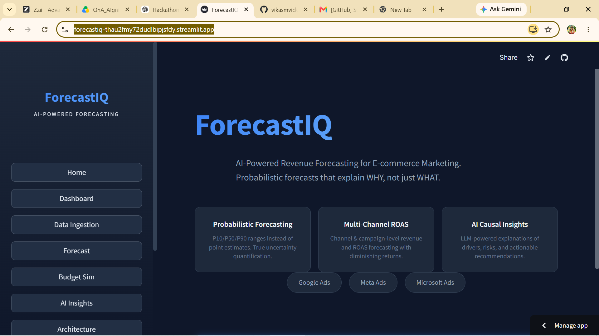
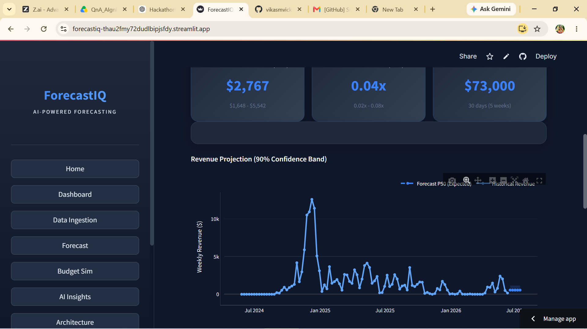
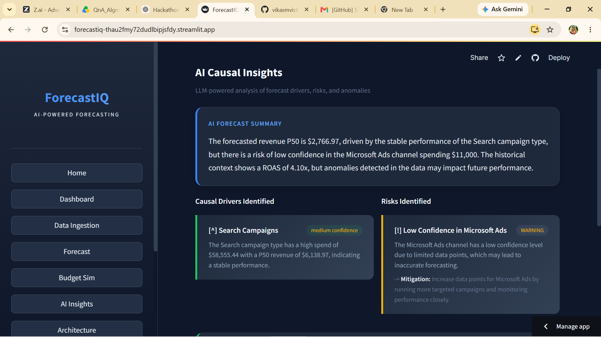
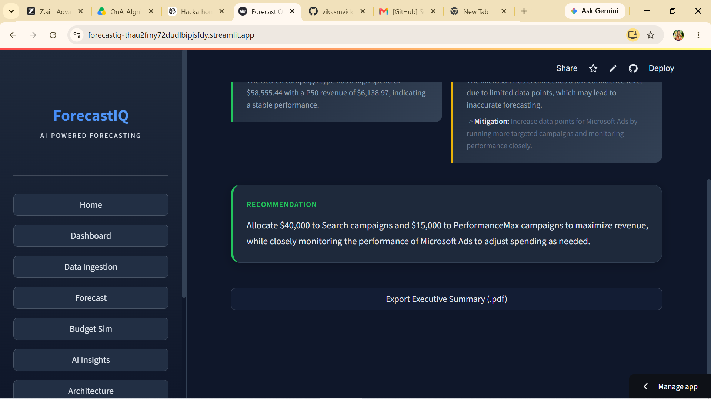

# 📈 ForecastIQ — AI-Powered Revenue Forecasting & Budget Optimization

> **Forecast future revenue. Optimize marketing budgets. Detect statistical anomalies. Generate AI-powered business insights.**


---

# 🚀 Live Demo

### 🌐 Streamlit Application

https://forecastiq-thau2fmy72dudlbipjsfdy.streamlit.app/

### 💻 GitHub Repository

https://github.com/vikasmvicky/forecastiq

---

# 📸 Application Preview

## 🏠 Home

<p align="center">

</p>

---

## 📊 Revenue Forecast Dashboard

<p align="center">

</p>

---

## 🤖 AI Causal Insights

<p align="center">

</p>

---

## 💡 Executive Recommendation & PDF Export

<p align="center">

</p>

---

# 🎯 Problem Statement

Marketing teams spend thousands of dollars every month across multiple advertising platforms such as **Google Ads**, **Meta Ads**, and **Microsoft Ads**.

However, forecasting future revenue, optimizing campaign budgets, identifying anomalies, and understanding *why* performance changes often require manual analysis and multiple tools.

ForecastIQ combines statistical forecasting, probabilistic simulation, explainable AI, and budget optimization into one intelligent decision-support platform.

---

# ✨ Key Features

✅ AI-powered Revenue Forecasting

✅ P10 / P50 / P90 Probabilistic Forecasts

✅ Monte Carlo Simulation

✅ Budget Optimization

✅ Multi-channel ROAS Analysis

✅ Statistical Anomaly Detection

✅ Historical Backtesting (MAPE & RMSE)

✅ AI Causal Insights

✅ Executive Recommendation Engine

✅ Executive PDF Report Export

✅ Interactive Streamlit Dashboard

---

# 🏗 System Architecture

```text
                     Advertising Campaign Data
        (Google Ads • Meta Ads • Microsoft Ads)
                             │
                             ▼
                    Data Ingestion Layer
                             │
                             ▼
                 Data Cleaning & Preprocessing
                             │
                             ▼
                  Weekly Feature Engineering
                             │
         ┌───────────────────┼───────────────────┐
         ▼                   ▼                   ▼
 Revenue Forecast     Budget Optimization   Anomaly Detection
(Holt-Winters)       (Log Response Curve)    (Z-Score Model)
         │                   │                   │
         └───────────────────┴───────────────────┘
                             │
                             ▼
                 Monte Carlo Simulation
                             │
                             ▼
                  AI Insight Generation
                   (Groq • Llama 3.3)
                             │
                             ▼
          Streamlit Dashboard + PDF Reports
```

---

# 🛠 Technology Stack

| Layer | Technologies |
|--------|--------------|
| **Frontend** | Streamlit |
| **Backend** | Python 3.11 |
| **Data Processing** | Pandas, NumPy |
| **Forecasting** | Holt-Winters Exponential Smoothing |
| **Statistical Modeling** | SciPy |
| **Probabilistic Forecasting** | Monte Carlo Simulation |
| **Machine Learning** | Scikit-learn, Joblib |
| **Visualization** | Plotly, Matplotlib |
| **Generative AI** | Groq API, Llama 3.3 70B |
| **Anomaly Detection** | Z-Score Statistical Analysis |
| **Budget Optimization** | Logarithmic Response Curve |
| **Report Generation** | FPDF2 |
| **Environment** | Python-Dotenv |
| **HTTP/API** | Requests |
| **Version Control** | Git & GitHub |

---

# 📂 Project Structure

```text
ForecastIQ/
│
├── app.py
├── run.sh
├── requirements.txt
├── README.md
│
├── data/
│   └── raw/
│
├── docs/
│   ├── home.png
│   ├── forecast.png
│   ├── insights.png
│   └── recommendation.png
│
├── output/
│
├── pickle/
│   └── model.pkl
│
└── src/
    ├── preprocess.py
    ├── forecast.py
    ├── budget_sim.py
    ├── anomaly_detection.py
    ├── backtest.py
    ├── llm_insights.py
    ├── predict.py
    ├── save_model.py
```

---

# ⚙ Installation

Clone the repository

```bash
git clone https://github.com/vikasmvicky/forecastiq.git
```

Move into the project

```bash
cd forecastiq
```

Install dependencies

```bash
pip install -r requirements.txt
```

---

# ▶ Run the Application

```bash
streamlit run app.py
```

---

# ⚡ Hackathon Evaluation Pipeline

ForecastIQ fully supports the required automated testing workflow.

```bash
./run.sh ./data ./pickle/model.pkl ./output/predictions.csv
```

This command:

- Reads input data
- Performs preprocessing
- Loads the trained model
- Generates revenue forecasts
- Writes predictions to the specified CSV output

---

# 📊 Outputs

ForecastIQ generates:

- 📈 Revenue Forecast (P10, P50, P90)
- 💰 ROAS Forecast
- 📊 Channel-wise Revenue Analysis
- 🎯 Budget Optimization Recommendations
- 🚨 Statistical Anomaly Report
- 📉 Historical Backtesting Metrics
- 🤖 AI-generated Business Insights
- 📄 Executive PDF Report
- 📂 CSV Prediction Output

---

# 👨‍💻 Team

## Team Name

**Vikas**

### Team Member

| Name | Role |
|------|------|
| **Vikas M** | AI/ML Engineer • Data Scientist • Full Stack Developer |

---

## College

**Global Academy of Technology**

Bengaluru, Karnataka, India

---

## Contact

📧 **vikasgowdam022@gmail.com**

---

# 🏆 Developed For

**AIgnition Hackathon 2026**

ForecastIQ is an AI-powered marketing intelligence platform built for AIgnition Hackathon 2026. It combines statistical forecasting, probabilistic modeling, anomaly detection, and explainable AI to help businesses make confident, data-driven marketing decisions.

---

# ⭐ Support

If you found this project useful, consider giving it a ⭐ on GitHub.

Feedback, suggestions, and contributions are always welcome.
